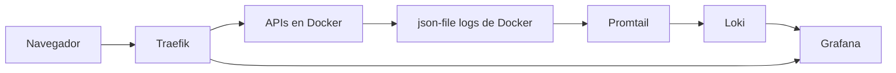

Tener varias APIs corriendo en un mismo EC2 es cómodo hasta que algo falla en producción y la única respuesta operativa es abrir `docker logs` contenedor por contenedor.

Durante un tiempo trabajé así. Servía para salir del paso, pero no para tener visibilidad real. Cuando convivís con varios servicios, errores intermitentes, reinicios, requests que entran por Traefik y despliegues frecuentes, el problema deja de ser "ver logs". El problema pasa a ser **encontrar rápido el log correcto**, en el rango correcto, del servicio correcto.

Ahí fue cuando decidí armar un stack de observabilidad propio para mi infraestructura real, no una demo aislada. Hoy corre con Docker Compose sobre EC2 usando **Grafana + Loki + Promtail**.

## El problema no era generar logs, era poder usarlos

Mis aplicaciones ya logueaban. El problema era operativo.

- Los logs estaban dispersos entre contenedores.
- `docker logs` era suficiente para mirar algo puntual, pero incómodo para correlacionar eventos entre servicios.
- Cuando aparecía un error real, parte del tiempo se iba en reconstruir contexto antes de poder debuggear.

Eso se notaba más en dos situaciones bastante comunes:

La primera era cuando un problema involucraba más de un servicio. Si una request entraba por el reverse proxy y terminaba fallando en una API concreta, mirar un solo stream no alcanzaba.

La segunda era cuando el error no estaba pasando "ahora". Si necesitaba revisar qué había ocurrido hace una o dos horas, el flujo manual se volvía demasiado torpe.

En ese punto ya no me faltaban logs. Me faltaba **observabilidad utilizable**.

## La decisión: no pagar una plataforma que todavía no necesitaba

La salida obvia era usar un servicio managed. Datadog, CloudWatch o algo parecido.

No descarté esa opción por dogma. La descarté porque, para mi escala actual, el tradeoff no cerraba.

Quería resolver tres cosas:

- centralizar logs de todos los contenedores del host
- consultarlos rápido desde una UI razonable
- mantener el costo muy bajo

Para eso preferí un stack propio, chico y entendible. No necesitaba métricas distribuidas, tracing completo ni una plataforma de observabilidad enorme. Necesitaba dejar de pelearme con logs sueltos.

## La arquitectura real que terminé usando

La implementación quedó separada en un repo específico y deliberadamente chico.

- `loki` como backend de logs
- `promtail` como agente recolector
- `grafana` como capa de exploración y visualización
- una red Docker dedicada: `observability-network`
- volúmenes persistentes para Loki y Grafana

El `docker-compose.yml` principal no publica Loki hacia afuera y deja a Grafana expuesto solo de forma interna con `expose: 3000`. Para desarrollo local existe un override aparte que publica el puerto definido en `GRAFANA_PORT`. En producción eso me sirve porque el stack ya queda listo para vivir detrás del reverse proxy del servidor.

La forma más simple de ver la arquitectura es esta:



Hay un detalle importante en Promtail: no depende de tocar cada aplicación. Usa `docker_sd_configs` sobre `/var/run/docker.sock` y después resuelve el path real de cada contenedor en `/var/lib/docker/containers/<id>/*-json.log`.

Esa parte me importaba bastante, porque no quería meter una integración distinta por servicio. Quería que el stack pudiera escuchar **todo lo que Docker ya estaba produciendo**.

## Qué hace cada pieza en la práctica

### Promtail

Promtail es el que vuelve útil el setup.

En mi configuración:

- descubre contenedores con Docker service discovery
- parsea el formato de logs de Docker con `pipeline_stages: docker`
- etiqueta cada entrada con `job`
- agrega `container_id`
- normaliza el nombre del contenedor en `container`
- agrega `service` cuando existe el label `com.docker.compose.service`

Ese relabeling fue clave. Sin etiquetas consistentes, tener una UI mejor no cambia demasiado. Seguís teniendo logs, pero cuesta filtrarlos bien.

### Loki

Loki quedó configurado como almacenamiento filesystem, con esquema `tsdb`, sin auth y con una retención de `168h`.

Ese número no salió de un paper. Salió de una decisión práctica: quería una ventana razonable para revisar incidentes recientes sin convertir el stack en otra preocupación de storage.

También dejé Loki como backend interno. No me interesaba publicarlo hacia afuera. La exploración pasa por Grafana y listo.

### Grafana

Grafana está provisionado con Loki como datasource por defecto. Eso evita un paso manual cada vez que levanto el stack.

Entrás, vas a `Explore`, ejecutás una query como:

```logql
{job="docker"}
```

y ya tenés visibilidad de todo el host. Después filtrás por `container`, `container_id` o `service` según el caso.

La diferencia con el flujo anterior no es estética. Es de tiempo operativo.

## La integración con Traefik y el borde público

En mi servidor ya tengo Traefik resolviendo entrada HTTP y HTTPS para los servicios que publico. No quise romper ese criterio para observabilidad.

Por eso el stack quedó preparado para esto:

- en local, Grafana puede salir por `GRAFANA_PORT`
- en producción, Grafana puede quedar detrás del reverse proxy
- Loki no necesita exposición pública

Ese borde me parece bastante más sano que abrir todo "por si hace falta". La UI sí necesita acceso. El backend de logs, no.

## Los problemas reales que aparecieron

La parte interesante no fue levantar los tres contenedores. Fue hacer que la consulta de logs realmente sirviera cuando la necesitaba.

## Timeouts y sensación de que Grafana "no encuentra nada"

Uno de los primeros roces fue ese momento bastante engañoso donde abrís Grafana, corrés una query y la sensación es que no hay datos o que algo está roto.

No siempre había un problema de ingestión. A veces el problema era el rango temporal.

Si el time range no coincide con el momento donde realmente hubo actividad, el resultado parece vacío y terminás dudando de Loki, de Promtail o de toda la cadena. En la práctica, varias veces el ajuste importante no era tocar infraestructura, sino dejar de consultar "últimos 15 minutos" cuando el evento había pasado bastante antes.

## Queries que no devolvían resultados útiles

Otra fricción fue asumir nombres de labels o de contenedores que no coincidían con lo que Promtail estaba etiquetando de verdad.

Eso me llevó a ajustar el relabeling para dejar un formato más consistente entre `container`, `container_id` y `service`. Sin esa prolijidad, una query puede ser correcta a nivel sintáctico y seguir sin devolver lo que esperás.

La diferencia entre:

```logql
{job="docker", container="foodly-api"}
```

y una query armada con un label incorrecto es bastante simple de describir: una te deja debuggear, la otra te hace perder tiempo pensando que el stack no funciona.

## Configuración de Promtail

Promtail fue la pieza más sensible del setup.

No por compleja en volumen, sino porque un detalle mal definido en:

- descubrimiento de contenedores
- path de logs
- parsing del formato Docker
- relabeling

te arruina la experiencia completa.

De hecho, en el historial del repo hay ajustes específicos para mejorar el formato de etiquetas y dejar a Grafana listo para correr detrás de proxy. Ese tipo de cambios muestran bastante bien dónde estuvo la fricción real del setup: menos en "instalar la herramienta" y más en hacer que el resultado operativo sea consistente.

## Manejo del time range

Parece un detalle chico, pero no lo es.

Cuando estás debuggeando un incidente real, el time range en Grafana define si encontrás el evento en segundos o si entrás en una falsa pista. En mi caso terminé usando ese criterio de forma bastante más consciente:

- primero ubico más o menos cuándo ocurrió el problema
- después abro una ventana acotada
- recién ahí filtro por servicio o contenedor

Parece obvio cuando ya funciona. Antes de eso, es una de esas cosas que te hacen sentir que la herramienta responde mal, cuando en realidad la consulta está mal ubicada en el tiempo.

## Qué cambió después de implementarlo

El beneficio más claro fue la centralización.

En vez de entrar contenedor por contenedor, hoy tengo un punto único para revisar logs de todo el host. Eso cambia bastante el trabajo diario:

- puedo ver actividad por servicio
- puedo revisar errores de un rango puntual
- puedo cruzar señales entre varios contenedores
- puedo llegar más rápido al momento exacto del fallo

No convierte observabilidad en magia. Pero sí saca una capa entera de fricción manual que antes estaba todo el tiempo en el medio.

## El tradeoff real de este stack

La contracara también es bastante clara.

No es un servicio managed. Nadie me resuelve operación, upgrades, storage ni debugging del propio stack.

Eso implica:

- mantenimiento manual
- responsabilidad sobre configuración y persistencia
- más cuidado cuando cambian versiones o labels

A cambio, para mi tamaño actual, consigo algo que me importa más:

- costo muy bajo
- control completo del setup
- una arquitectura chica y entendible

No diría que esta sea la respuesta universal para observabilidad. Diría algo más concreto: para un EC2 compartido con varias APIs Docker, me resultó una solución razonable, barata y suficientemente buena como para dejar de depender de `docker logs` como herramienta principal.

Y eso, operativamente, ya fue una mejora enorme.
